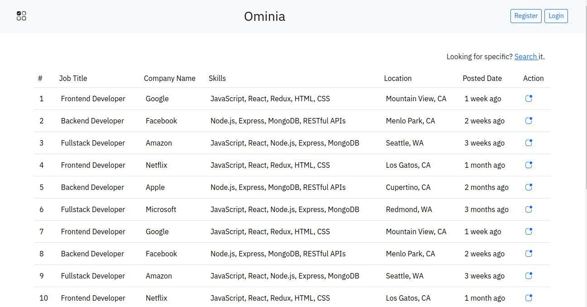
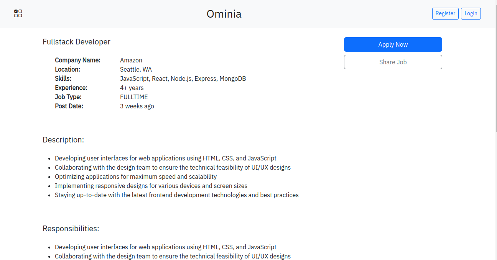
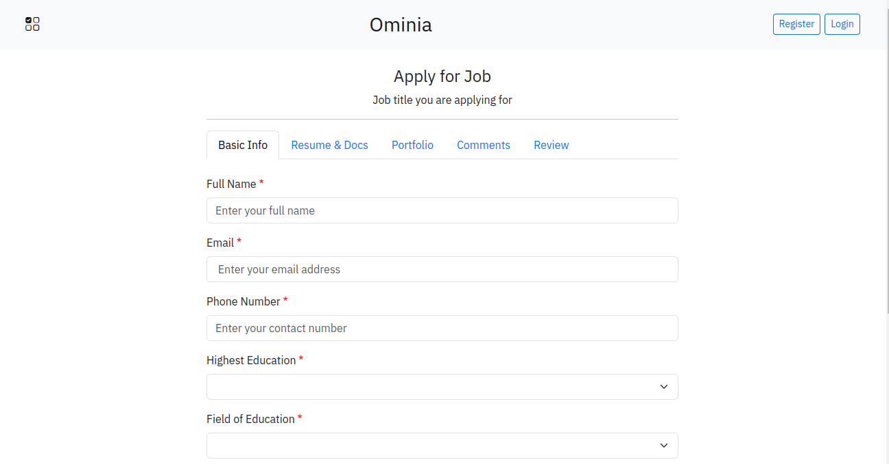
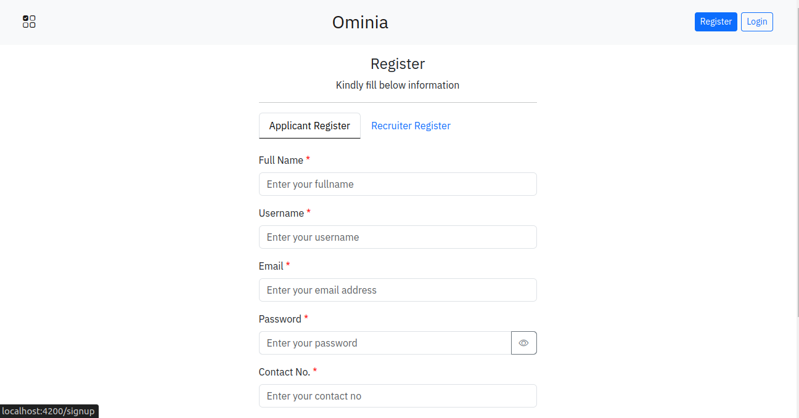

## Job Portal

### Overview
This is a full-stack job portal application designed to streamline job posting and job search processes. It allows recruiters to post jobs and track applications while enabling applicants to explore job listings and apply for roles. The project leverages Spring Boot for the backend and Angular 17 for the frontend to provide a robust and interactive user experience.
### Key Feature
Job Listings: Displays all available jobs in a clean and structured format.
Job Details: View detailed descriptions of specific jobs, including requirements and company details.
Job Posting: Recruiters can post new jobs and view all their posted jobs along with the total applications received.
Job Applications: Applicants can apply for any job by filling out an intuitive application form.

User Authentication:
Registration and Login: Secure user authentication with JWT (JSON Web Token).
Role-based profiles for recruiters and applicants.

User Profiles:
Recruiters: Manage posted jobs and monitor applications.
Applicants: View and update personal details.

### Technology Stack
Backend
Java: Core programming language.
Spring Boot: Framework for building the backend API.
Spring Security: Implements authentication and authorization.
JWT (JSON Web Token): Ensures secure user sessions.

Frontend
Angular 17: Framework for building the user interface.
Bootstrap 5: CSS framework for responsive design and styling.

### Screenshots
 

### Role-Based Access Control (RBAC)
Roles: Applicant, Recruiter, and Admin.
Access Control:
Applicants can browse jobs and apply.
Recruiters can manage job postings and view application statistics.
Admin has additional control over user management and moderation.
Partially implemented; future updates will enhance routing and resource access based on roles.

### Upcoming Features
Enhanced RBAC: Fully implement access control across all routes and resources.
Admin Dashboard: Tools for user and job management.
Notifications: Notify users of job-related updates.
Search & Filter: Advanced job search and filtering options.

TODOS:
- Access of resources/routing based on role, partially works
